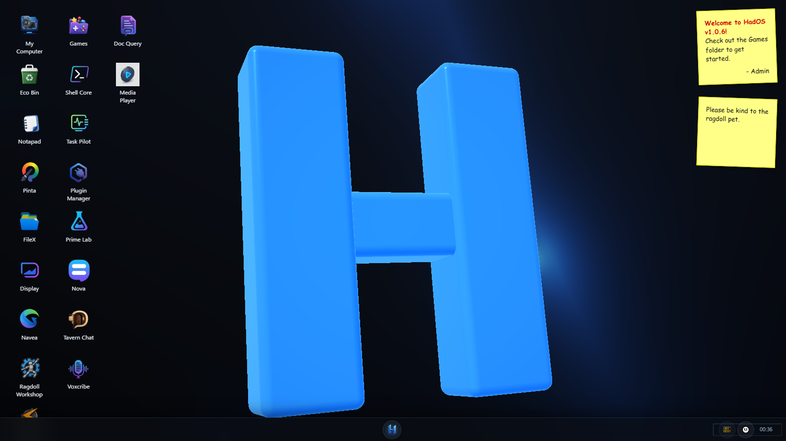
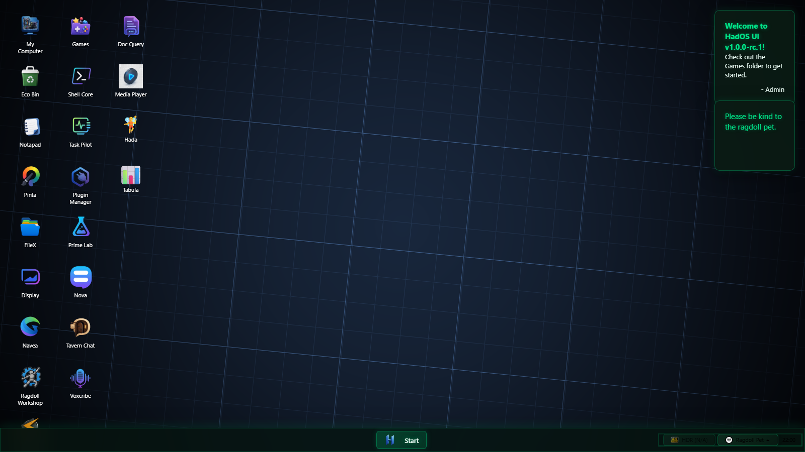
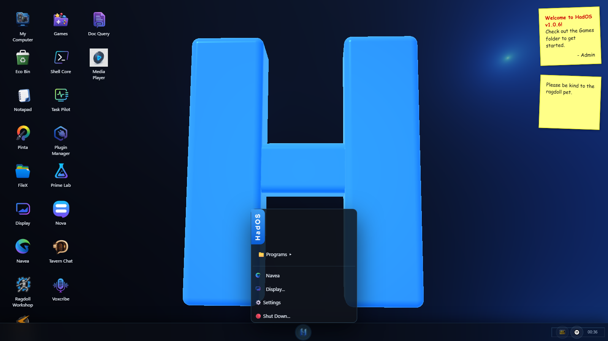
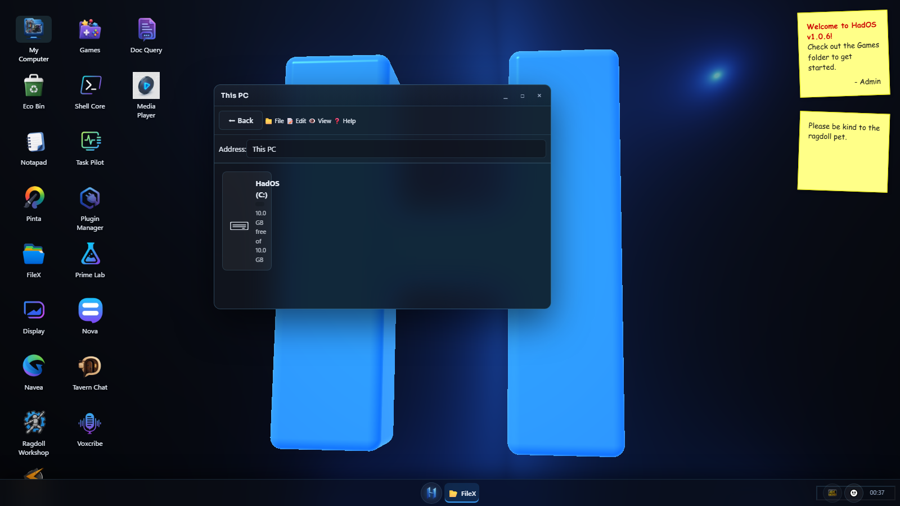
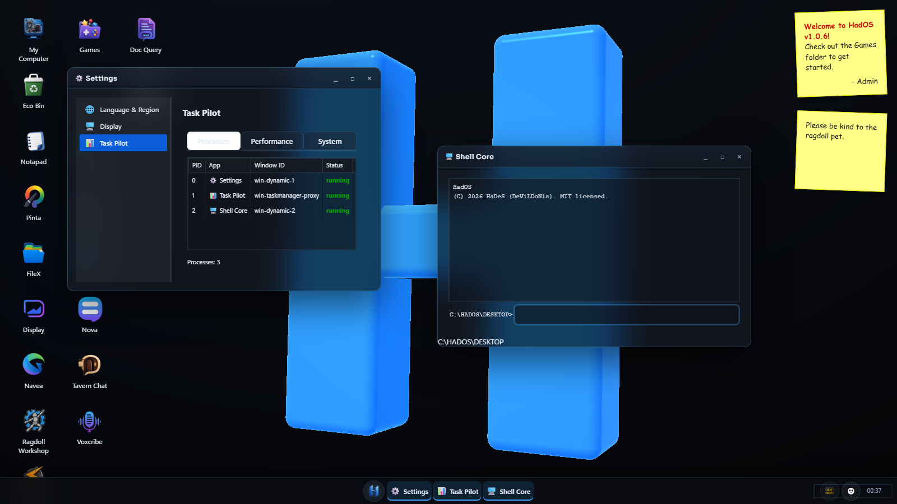
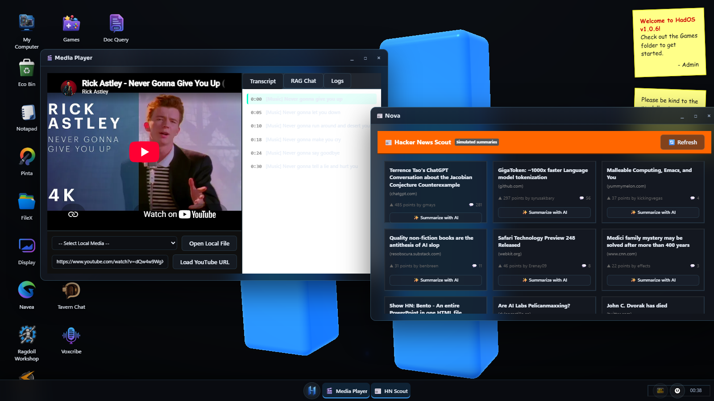
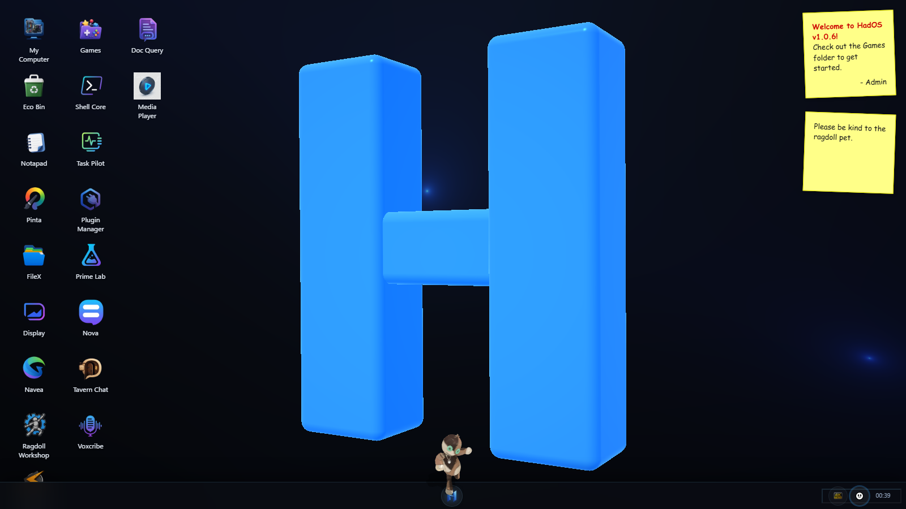
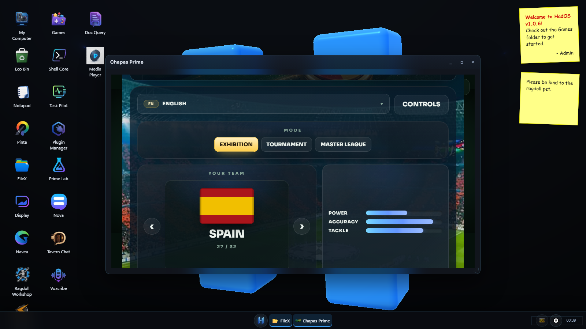
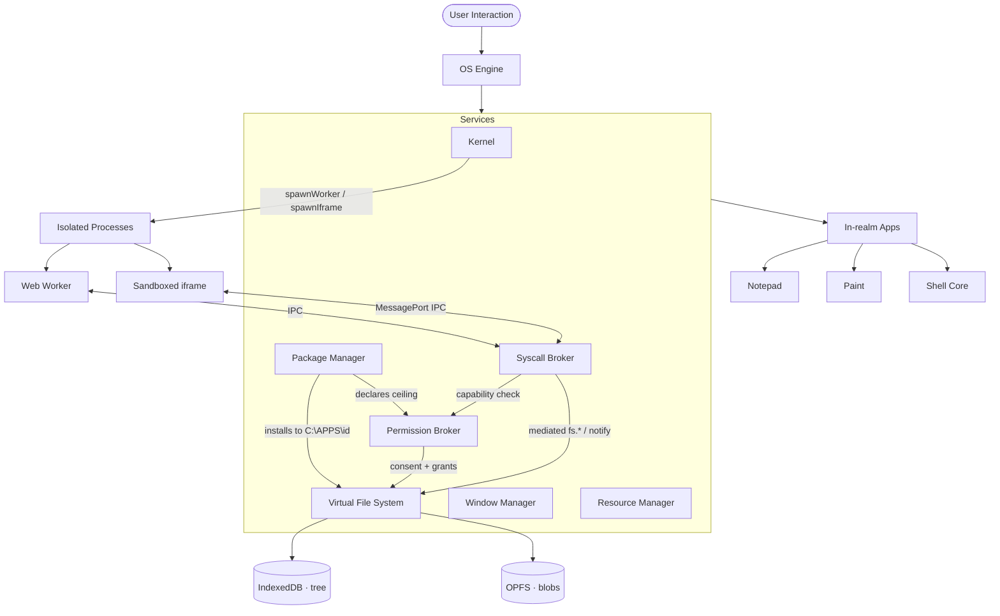

<div align="center">

# 🖥️ HadOS

**A Web OS with its own face: isolated processes, mediated syscalls and consented capabilities — running entirely in your browser.**

[](https://opensource.org/licenses/MIT)
[](https://www.typescriptlang.org/)
[](https://vitejs.dev/)
[](https://threejs.org/)
[](https://vite-pwa-org.netlify.app/)
[](#-testing)
[](https://github.com/Devildonia/HadOS/actions/workflows/ci.yml)

<p align="center">
  
</p>

<sub>No HadOS demo is published yet. Its predecessor, **Windows App Center** (v1.6.7), is playable at
<a href="https://hades-aka-devildonia.itch.io/windows-app-centre">itch.io</a> and archived at
<a href="https://github.com/Devildonia/windows-app-center">Devildonia/windows-app-center</a>.</sub>

</div>

---

HadOS is a fully functional desktop environment that runs entirely in the browser — and under the chrome sits a deliberately **production-grade architecture**: a process Kernel that spawns **isolated Worker/iframe processes** on an opaque origin, mediated **syscalls** behind user-consented **permissions**, an async **IndexedDB/OPFS** file system, a 3D physics engine, on-device **LiteRT.js** inference, a 40-language UI, and a 1031-test suite. It doubles as a **sandbox for developing modular systems** (VFS, Kernel, IPC, Rapier3D, Resource lifecycle) that can be extracted and ported into other projects.

> [!NOTE]
> HadOS continues the project formerly released as **Windows App Center**, which reached v1.6.7 and is [archived here](https://github.com/Devildonia/windows-app-center) with its full history. The architecture was built and audited across that line — every audit finding is encoded as a regression test — and follows a 6-phase **Web OS** design; per-phase notes live in [`docs/webos-roadmap/`](docs/webos-roadmap/), and the on-device AI design in [`docs/ai/`](docs/ai/). See the [CHANGELOG](CHANGELOG.md), and [`docs/known-issues.md`](docs/known-issues.md) for what is knowingly still wrong.

## 📋 Table of Contents
- [Why this exists](#-why-this-exists)
- [Screenshots](#-screenshots)
- [Features](#-features)
- [Tech Stack](#-tech-stack)
- [Getting Started](#-getting-started)
- [Usage](#-usage)
- [Testing](#-testing)
- [Architecture](#-architecture)
- [Project Structure](#-project-structure)
- [Creating an App](#-creating-an-app)
- [PWA & Offline](#-pwa--offline)
- [Browser Support](#-browser-support)
- [Roadmap](#-roadmap)
- [Known Limitations](#-known-limitations)
- [Contributing](#-contributing)
- [License & Credits](#-license)

---

## 🎯 Why this exists

The "desktop in the browser" space is crowded — so this project leans on **engineering quality** rather than feature count:

- 🧠 **Real OS primitives, not a mockup.** A process `Kernel` that spawns genuinely **isolated processes** (Web Worker / sandboxed iframe) over an authenticated per-process IPC channel — a `while(true)` in an app can't freeze the desktop, and a watchdog kills it. Apps reach the system only through **mediated syscalls** gated by **user-consented capabilities**, and are confined to their own home directory.
- 🦴 **A 3D physics pet.** An interactive ragdoll powered by **Rapier3D + Three.js** with grab physics, procedural animation, and an AI state machine — a differentiator you won't find in most desktop clones.
- 🔬 **Determinism by design.** Zero `Math.random()` in logic paths; seeded PRNG where reproducibility matters. Hot paths are zero-allocation with a fixed-timestep loop.
- 🤖 **A real on-device AI substrate.** Three inference engines behind consented capabilities, all running on your machine with nothing uploaded: **LiteRT.js** segmentation (Pinta removes photo backgrounds), **MediaPipe LLM Inference** over a user-imported Gemma (Tavern Chat holds real conversations, Nova summarises Hacker News discussions, Doc Query answers grounded questions), and **transformers.js** (Whisper transcribes local media with real timestamps; MiniLM embeddings power true semantic search). Isolated worker processes, per-app consent, download-once caches.
- ✅ **1031 tests** (unit, characterization & Playwright E2E) with coverage gates in CI — rare in this niche.
- 🎨 **Intentional aesthetics.** A chrome of its own — dark surfaces, the blue of the mark, macOS-style glass, and a raymarched logo wallpaper — driven by a token-based theme engine, plus a "Modern" theme. No AI-default look.
- 🗣️ **Honest by policy.** Simulated features say so on their face (a summary panel is labelled *"simulated demo"*, demo data is stamped `[DEMO]`), and anything that could send data off-device — like browser speech recognition — sits behind an explicit consent prompt. Every external audit finding is remediated and encoded as a regression test.
- 🌍 **40 languages.** The entire UI — apps, dialogs, folder names, the works — ships localized in 40 locales, with typed i18n keys and a locale-sync script that keeps all 40 files in shape.
- 🧩 **Built to be extended.** Auto-registering apps, a scaffolder (`npm run generate:app`), and a runtime plugin API.

---

## 📸 Screenshots

| HadOS theme | Modern theme |
|:---:|:---:|
|  |  |
| **Start Menu** | **This PC — a real, quota-backed drive** |
|  |  |
| **Multitasking — Task Pilot & Shell Core** | **Media apps — Media Player & Nova** |
|  |  |
| **3D Physics Ragdoll** | **Games Arcade (sandboxed)** |
|  |  |

---

## ✨ Features

### 🏢 Desktop Environment
- **Process Kernel** — a real process table (`launch`/`kill`, PID registry, singleton handling) that owns every app's lifecycle, and spawns **isolated processes**: `spawnWorker()` (Web Worker) and `spawnIframe()` (sandboxed iframe over an authenticated `MessagePort`), each tagged with its `kind`.
- **Process isolation + watchdog** — heavy work runs off the main thread, so an app can't freeze the desktop; a `ProcessWatchdog` pings processes and kills unresponsive ones. **Prime Lab** demos it: the UI stays live while a worker crunches primes.
- **App Runtime SDK** — a guest-side SDK (`js/sdk/appRuntime.ts`) so an isolated app speaks the IPC protocol declaratively: it announces readiness, auto-answers pings, routes requests, and calls `syscall(name, args)`.
- **Syscalls + permissions** — processes reach the system only through mediated syscalls (`fs.read`/`fs.list`/`fs.write`/`notify`/`sys.log`), gated by a `PermissionBroker` that asks the user on first use and remembers the decision, and confined to the app's own home dir (`C:\APPS\<id>`).
- **App packaging** — install `.wapp` packages: an `app.json` manifest (id, semver, entry, declared `permissions`) validated and versioned, files laid into the app home, SHA-256 integrity stamp, a local registry, clean updates and uninstall. Declared permissions are the ceiling the broker enforces.
- **Service Container (DI)** — decoupled systems (Kernel, VFS, Window Manager, Audio, Resource Manager) resolved through a typed registry.
- **Virtual File System** — hierarchical directories persisted **asynchronously to IndexedDB** (escaping the ~5–10 MB `localStorage` cap), with binary/large files stored out-of-tree in **OPFS**, debounced writes, quota handling and automatic migration from the legacy `localStorage` tree.
- **Native Window Manager** — drag, resize, minimize, maximize, z-index focus, **Aero-style edge snapping**, and deterministic teardown.
- **Draggable, magnetic taskbar** — grab the bar and snap it to **any of the four screen edges**; the start button (circular, macOS-style) and the app cluster stay centered, the system tray adapts to vertical orientations, and maximized windows respect the bar's work-area insets wherever it docks.
- **A real, unified explorer** — "My Computer" opens FileX at a **This PC** root showing one honest drive, **HadOS (C:)**, whose capacity is the real browser storage quota from `navigator.storage.estimate()`. The Games desktop icon is a shortcut into the same explorer at `C:\GAMES` — one explorer, no bespoke windows.
- **40-language i18n** — every label in the UI is translated, **including the explorer's folder names** (display labels are localized while canonical paths stay stable), with typed keys and a sync script that keeps all 40 locale files aligned.
- **Session resume** — the desktop remembers which apps are open and their layout, and restores them on reload.
- **Resource Manager** — owner-scoped registry (WebGL, audio, listeners, timers) with LIFO disposal for leak-free cleanup.
- **Theme Engine** — switch between *HadOS* and *Modern* live; all UI is token-driven. The HadOS theme wears a **macOS-style glass material** (translucent surfaces with backdrop blur) tuned to keep the project's own palette.
- **Plugin API** — validate and register/unregister third-party apps at runtime through the Kernel.
- **♿ Accessibility** — ARIA roles, Alt+Tab window switcher, focus management, and an `aria-live` screen-reader announcer.

### 🎮 Ragdoll Pets (2D & 3D)
- **3D Physics Ragdoll** — Rapier3D + Three.js, with elastic grab, procedural animation, and AI states (Wander / Idle / Perform).
- **2D Stickman Pet** — Matter.js physics pet that reacts to the mouse, windows, and desktop icons.
- **Workshop** — customize skins, scale, and behavior.

### 🛠️ Built-in Applications
📝 **Notapad** (VFS save/load, find & replace, multi-window, **AI menu**: summarize/rewrite/translate on-device) · 🎨 **Pinta** (tools, color pickers, undo/redo, **AI background removal on-device**) · 📂 **FileX** (unified explorer with This PC) · 🌐 **Navea** browser (history + URL safety filter) · 📻 Webamp · ⚙️ Control Panel & Settings (HDR, wallpapers, themes, language) · 🖥️ **Shell Core** (VFS-backed terminal) · 📊 **Task Pilot** (live process monitor) · 🧩 **Plugin Manager**.

### 🎙️ Media & demo apps
Five apps that show the platform's range — and practice its honesty policy (anything simulated is labelled as such, in the UI itself):
- 🎬 **Media Player** — local video/audio and YouTube. The embed is driven **directly via postMessage** (`enablejsapi=1` widget protocol) — no external YouTube script, so the strict CSP stays intact. **Local files get REAL on-device transcription** (Whisper, ~140 MB one-time download behind consent) with model timestamps driving the karaoke highlight and click-to-seek; YouTube's panel honestly explains that an embed's audio is unreachable from the browser.
- 📰 **Nova** — a Hacker News reader: live top stories from the official Firebase API; if the network fails you get an honest error with a Retry button, and demo data only by explicit opt-in, stamped `[DEMO]`. With a Gemma model imported, the summary panel **really summarises the thread's discussion on-device** (the badge flips to `On-device AI`); without one it stays a labelled simulated demo.
- 🎙️ **Voxcribe** — scripted podcasts via browser text-to-speech, a **Melody Lab** where Gemma composes in strict notation for the local synth, plus voice dictation with an engine selector: **on-device Whisper by default** (nothing leaves your machine) or the browser's cloud engine for live streaming, behind a consent that warns the audio may leave (`speech:cloud`).
- 💬 **Tavern Chat** — chat with scripted characters (canned replies; says so in its description).
- 🧚 **Hada** — a **voice assistant that never phones home**: push-to-talk → Whisper hears you → Gemma answers **and can operate the OS** ('abre Pinta' launches Pinta — intents validated against the app allowlist, a wrong guess can only produce words, never actions) → the browser speaks, every step on your machine (a new `mic:record` capability gates the capture, before the browser's own mic prompt). The requirements panel honestly names any missing piece and keeps the mic disabled until the stack is real.
- 📄 **Doc Query** — indexes one document or **all of them at once** with **real MiniLM embeddings** (~23 MB behind consent): search is true cosine similarity, answers cite `[file:line]` provenance, and the vector-space canvas shows a **PCA projection of the actual vectors**. With a Gemma model imported, the retrieved lines feed the model and **answers are generated on-device, grounded and cited**. Deny the consent and it falls back to labelled keyword search.
- 📊 **Tabula** — CSV analysis where **the numbers must be real**: parsing and per-column statistics computed in code (an LLM doing arithmetic is a hallucination with confidence); the imported model only *narrates* the precomputed figures, under a prompt that forbids inventing them.

### 🧠 On-device AI substrate

Three inference engines, one architecture: every model runs in an **isolated worker
process**, every use is gated by a **consented capability** the broker remembers per
app, and every feature **states its mode in its own UI** (real vs. labelled fallback).
Nothing ever leaves the device. Per-phase design notes live in [`docs/ai/`](docs/ai/).

| Engine | Model | Delivery | Capability | Consumers |
|---|---|---|---|---|
| LiteRT.js | DeepLab v3 (2.7 MB) | pinned URL + SHA-256, OPFS cache | `ai:infer` | Pinta background removal |
| MediaPipe LLM | Gemma 3 1B (~550 MB) | **user-imported** (license-gated), hash-verified | `ai:chat` | Tavern Chat · Nova · Doc Query · Hada · Tabula · Notapad · Voxcribe |
| transformers.js | Whisper base q4 (~140 MB) | downloaded on consent, Cache API | `ai:transcribe` | Media Player · Hada · Voxcribe |
| transformers.js | MiniLM-L6 q8 (~23 MB) | downloaded on consent, Cache API | `ai:embed` | Doc Query semantic index |

Two worker processes back this: the classic `ai-runtime` (LiteRT needs
`importScripts()`; MediaPipe rides along) and the module `asr-runtime`
(transformers.js needs dynamic `import()`) — their loaders want opposite worlds, so
they stay separate. The model registry is a **security boundary**: apps name models
by id, and no URL ever crosses the syscall surface.

### 🕹️ Games Arcade
Sandboxed in isolated iframes and registered with the Kernel: 🎮 Virtual Life Restart Sim · 🐦 Flappy Neon · ⚽ Football Rush · 🔫 Ultimate DOOM · 🧱 Tetris Tryhard · 🔴 Chapas Prime (Three.js) · 🌙 Nocturna (Web Audio rhythm) · 👾 H.I.P. Game Boy (3D WebGL).

### 🌈 Advanced Visuals
- **GLSL Wallpaper Engine** — multi-pass shaders for dynamic backgrounds, including a raymarched HadOS mark drawn entirely in GLSL.
- **HDR Support** — detection and toggling of High Dynamic Range rendering.
- **BIOS & Boot** — POST screen that reports your real hardware (CPU, GPU, memory, storage quota), then a splash whose progress bar waits on the actual boot.

---

## 🧰 Tech Stack

| Layer | Technology |
|---|---|
| Language | TypeScript 5.9 (`strict`, zero `@ts-ignore`) |
| Build / Dev | Vite 5, `vite-plugin-pwa` (Workbox `injectManifest`) |
| 3D / Physics | Three.js r183, Rapier3D (WASM) |
| 2D Physics | Matter.js |
| AI — vision | LiteRT.js (`@litertjs/core`) — DeepLab v3 segmentation, WebGPU/WASM |
| AI — language | MediaPipe LLM Inference (`@mediapipe/tasks-genai`) — Gemma over WebGPU |
| AI — speech & embeddings | transformers.js (`@huggingface/transformers`) — Whisper + MiniLM on WASM |
| Audio | Web Audio API (procedural synthesis) |
| Graphics | WebGL2, GLSL shaders |
| Testing | Vitest 4 (+ v8 coverage), Playwright |
| Tooling | ESLint (typescript-eslint), Tailwind (games build only) |

---

## 🚀 Getting Started

### Prerequisites
- [Node.js](https://nodejs.org/) **v18+**
- npm (or yarn)

### Installation
```bash
# 1. Clone
git clone https://github.com/Devildonia/HadOS.git
cd HadOS

# 2. Install
npm install

# 3. Run the dev server (http://localhost:3000)
npm run dev

# 4. Production build + local preview
npm run build
npm run preview
```

---

## 🎮 Usage

**Opening apps:** double-click a desktop icon or use the **Start Menu**.

**Moving the taskbar:** grab an empty area of the bar and drag — it snaps magnetically to whichever screen edge you release it near (bottom, top, left or right).

**Exploring files:** double-click **My Computer** to land at **This PC** and drill into the **HadOS (C:)** drive; the **Games** icon jumps straight to `C:\GAMES` in the same explorer.

**Keyboard shortcuts**
| Shortcut | Action |
|---|---|
| `Alt` + `Tab` | Cycle windows forward |
| `Shift` + `Alt` + `Tab` | Cycle windows backward |
| `Shift` + `F10` | Context menu |

**Shell Core commands**
```text
help            Show available commands
ver             Print version info
dir / ls        List the current directory
cd <dir>        Change directory (supports .. and absolute C:\ paths)
type / cat      Print a file's contents
echo <t> > file Write text to a file
mkdir <name>    Create a directory
del / rm <n>    Delete a file or directory
ren <old> <new> Rename
cls / clear     Clear the screen
```
Use `↑` / `↓` to navigate command history.

---

## ✅ Testing

**1031 tests across 92 files** — unit, *characterization* (behavior-locking tests for the Kernel, Window Manager, and Audio Manager), regression tests that encode every audit finding, error-path tests (storage quota, denied permissions, crashed processes), and Playwright end-to-end boot/interaction specs. Coverage thresholds are enforced as blocking CI gates.

**Plus a CSS baseline** ([`test/e2e/css-baseline.spec.ts`](test/e2e/css-baseline.spec.ts)). None of those 1031 tests evaluate a stylesheet — jsdom does not load external CSS, so `style.css` could be deleted and they would all still pass. The baseline pins the **parsed CSSOM** (every rule, in cascade order), the **computed styles** of every chrome surface in both themes and at desktop and phone viewports, and **screenshots**. Run it before and after any stylesheet change; only pass `--update-snapshots` when a visual change is intended.

```bash
npm test              # watch mode
npm run test:run      # single run (verbose)
npm run test:ui       # Vitest UI
npm run test:coverage # coverage report (v8)
npm run test:e2e      # Playwright E2E
npm run typecheck     # tsc --noEmit
npm run lint          # ESLint
```

**CI (GitHub Actions):** runs on every push/PR to `main`, in three blocking jobs — **Code Quality** (`lint` + `typecheck` + `test:coverage`), **E2E** (Playwright), and **Production Build**.

---

## 🏗️ Architecture



Isolated processes never touch the VFS directly: they issue **syscalls** over their own
authenticated IPC channel, the **Syscall Broker** checks the capability with the
**Permission Broker** (user consent, remembered), and only then does it reach the VFS —
confined to the app's home directory.

### Architecture highlights
- **Kernel** — a `Map<pid, process>` registry with immediate cleanup on `kill()` and automatic `terminate()` propagation to app instances. Singleton apps refocus their running instance instead of duplicating. Processes are tagged `app` (in-realm), `worker` or `iframe`. Internally split into focused modules (`core/kernel/`: `AppRegistry`, `ProcessManager`, `KernelTypes`) behind the same public facade.
- **Process isolation & IPC** — `spawnWorker()`/`spawnIframe()` run code off the Kernel's realm behind a versioned IPC protocol. The host handle (`WorkerProcess`) talks to an injectable transport, so a Worker, a `MessagePort` or a test loopback are interchangeable. iframe processes get a **dedicated, authenticated `MessagePort`** (the host hands the port only to its own iframe; the guest accepts it only from `window.parent`) instead of the global `window` bus.
- **Syscalls, permissions & packaging** — a `SyscallBroker` mediates `fs.*`/`notify`/`sys.log`; a `PermissionBroker` asks the user for consent per capability and persists the grant; a `PackageManager` installs versioned `.wapp` packages whose manifest declares the permission ceiling. Every app is confined to `C:\APPS\<id>`.
- **VFS** — an in-memory tree (synchronous reads) over async **IndexedDB** persistence, with binary blobs in **OPFS** so large files never bloat the serialized tree. Split into modules (`core/vfs/`: `VFSCoreTree`, `VFSOperations`, `VFSTrash`, `VFSTypes`) — including a real, restorable **recycle bin** (`trashNode`/`restoreFromTrash`/`emptyTrash`).
- **Event-driven core** — a zero-allocation event bus where each handler is isolated (one failing listener never breaks the others), plus a reactive, persisted store.
- **Service Container** — a typed DI registry with async resolution (`whenReady`) and HMR-safe `unregister`.
- **Resource Manager** — owner-scoped disposables with LIFO teardown; `Kernel.kill()` and each app's `terminate()` release their WebGL contexts, audio nodes, listeners, and timers deterministically.
- **Determinism** — logic paths avoid `Math.random()`; hot paths use preallocated buffers and a fixed-timestep accumulator with render interpolation.

---

## 📁 Project Structure

```text
HadOS/
├─ js/
│  ├─ core/        # EventBus, Store, Service Container, Ragdoll3D core…
│  │  ├─ kernel/   # Kernel internals — AppRegistry, ProcessManager, KernelTypes
│  │  ├─ vfs/      # VFS internals — VFSCoreTree, VFSOperations, VFSTrash, VFSTypes
│  │  ├─ ipc/      # versioned process IPC protocol
│  │  ├─ VFS·VFSStore·VFSBlobStore        # facade + IndexedDB + OPFS blobs
│  │  ├─ WorkerProcess·IframeProcess      # isolated process handles + transports
│  │  ├─ ProcessWatchdog·SyscallBroker    # liveness + mediated system access
│  │  ├─ PermissionBroker·PackageManager  # consent/grants + .wapp install
│  │  └─ SessionManager·ResourceManager   # session resume + leak-free teardown
│  ├─ ai/          # the AI substrate: AiService facade, LiteRT/GenAI/ASR/Embed engines,
│  │               #   model cache (OPFS), Gemma prompt template, grounded-generation
│  │               #   helpers, vector math (cosine top-K, PCA) — all seam-tested
│  ├─ apps/        # Notapad, Pinta, Shell Core, Task Pilot, Media Player… (auto-registered)
│  │  ├─ audiostudio/ · explorer/ · notepad/ · paint/ · taskmanager/  # per-app modules
│  ├─ sdk/         # guest-side App Runtime SDK (appRuntime, guestBoot)
│  ├─ workers/     # worker-process entries: compute, ai (classic), asr (module)
│  ├─ ui/          # WindowFactory, WindowInteractions (drag/snap), TaskbarDock, ShaderWallpaper…
│  ├─ audio/       # AudioManager, procedural synth
│  ├─ services/    # i18n (typed keys) and other cross-cutting services
│  └─ utils.ts     # shared helpers (escapeHTML, eventManager, logger…)
├─ css/            # stylesheet partials — base/ boot/ chrome/ desktop/ apps/ system/ effects/
├─ style.css       # entry: an ORDERED @import manifest, nothing else (order is load-bearing)
├─ docs/
│  ├─ webos-roadmap/  # per-phase design notes (0 → 5)
│  ├─ ai/             # on-device AI design notes (phases 0-3: segmentation, LLM chat,
│  │                  #   Whisper transcription, semantic embeddings)
│  └─ known-issues.md # what is knowingly still wrong, with evidence
├─ public/
│  ├─ games/       # sandboxed iframe games
│  ├─ locales/     # 40 language files (en, es, fr, de, ja, ar, …)
│  ├─ css/themes/  # theme-base / theme-hados / theme-modern tokens
│  ├─ wasm/litert/ # LiteRT.js WASM runtime (copied at install)
│  └─ ai-runtime.js # prebuilt classic-worker AI process (vite.ai-worker.config)
├─ sw.ts           # PWA service worker source (Workbox injectManifest)
├─ test/           # Vitest unit/characterization + Playwright E2E (css-baseline)
├─ scripts/        # create-app, sync-locales, generate-i18n-types, copy-litert-wasm
├─ process-guest.html  # iframe process guest document (Vite entry)
└─ main.ts         # entry — hydrates the VFS, boots the OS, resumes the session
```

---

## 🧩 Creating an App

Apps **auto-register** — any file in `js/apps/*.ts` that calls `Kernel.registerApp(...)` is picked up automatically (no manual wiring). Scaffold one with:

```bash
npm run generate:app
```

Or write it by hand (see `js/apps/MyTestApp.ts` for the full template):

```ts
import { Kernel } from '../core/Kernel.js';
import { WindowFactory } from '../ui/WindowFactory.js';
import type { IWindowsApp } from '../core/Types.js';

export class MyApp implements IWindowsApp {
  public windowId = '';
  constructor() {
    this.windowId = WindowFactory.create({ title: 'My App', icon: '🧪', width: 400, height: 300 });
    // …render into WindowFactory.getBody(this.windowId)…
  }
  terminate(): void {
    // release listeners/timers, then:
    WindowFactory.destroy(this.windowId);
  }
}

Kernel.registerApp('myapp', MyApp, { name: 'My App', icon: '🧪', singleton: false });
```

**Runtime plugins:** third-party `IAppPlugin` definitions are validated by `PluginManager.validatePlugin` (ID pattern, required metadata, constructor check, duplicate-ID guard) and registered via `Kernel.installPlugin` / removed with `Kernel.uninstallPlugin`.

---

## 📦 PWA & Offline

The app ships as an installable PWA. A Workbox service worker (generated from the real build via `vite-plugin-pwa`'s `injectManifest`) precaches the app shell, so it launches offline after the first visit and can be installed to the desktop/home screen.

---

## 🌍 Browser Support

Best experienced in a recent **Chromium-based browser** (Chrome, Edge, Brave). Requires **WebGL2** for the 3D ragdoll and shader wallpapers. Firefox and Safari run the desktop and 2D features; some heavy 3D/HDR effects and the JS-heap readout in Task Pilot are Chromium-only.

---

## 🗺️ Roadmap

The 6-phase **Web OS** roadmap (async VFS → isolated processes → syscalls → permissions →
packaging → session) shipped during the Windows App Center line (v1.6.6); design notes per
phase live in [`docs/webos-roadmap/`](docs/webos-roadmap/). Since then, the HadOS line has
added the complete **on-device AI substrate** ([`docs/ai/`](docs/ai/), phases 0–3:
segmentation, LLM chat, Whisper transcription, semantic embeddings), the unified
**This PC** explorer, the **magnetic taskbar**, the macOS-style glass, and 40-language
folder localization. What's next:

- **Real zip container** for `.wapp` packages (the manager already takes a parsed package, so a zip loader plugs in) plus **package signing** via SubtleCrypto, and a store/catalog UI.
- **Permissions UI** — review, grant and revoke app capabilities from Settings.
- **Virtual workspaces** — multiple desktops (no compositor needed; just group windows per workspace).
- **Separate-origin guests** — serve third-party apps from a subdomain for defence in depth on top of today's opaque-origin sandbox (it would also isolate each guest's own storage).
- More capabilities: `net.fetch`, `clipboard.*`, `window.open`.

See the [CHANGELOG](CHANGELOG.md) `[Unreleased]` section for the latest.

---

## ⚠️ Known Limitations

- **Persistence** is client-side: the VFS tree lives in **IndexedDB** and binary files in **OPFS** (hundreds of MB, subject to the browser's storage quota), with a `localStorage` fallback where IndexedDB is unavailable. Durability on an abrupt close is best-effort — async writes are flushed on `visibilitychange`, which is more reliable than `beforeunload`.
- **Single-user / client-side only** — no accounts, no server sync.
- **Third-party code isolation** — apps run in a sandboxed iframe with an **opaque origin** (`allow-scripts`, no `allow-same-origin`) and reach the system only through a dedicated, authenticated channel: they cannot touch the host DOM, `localStorage` or IndexedDB. A **separate origin** (subdomain) would still add defence in depth — it would also isolate the guest's *own* storage and cover sandbox escapes — but it is no longer required for third-party isolation. By design, no untrusted code is `eval`'d.
- Fake "hardware" figures in Task Pilot's *System* tab are **simulated** (deterministic), not real device telemetry.
- **Voice dictation uses the browser's own speech recognition** (`webkitSpeechRecognition`), which in Chromium may send audio to the browser vendor's servers. HadOS gates it behind an explicit consent prompt (`speech:cloud` capability) that says exactly that — but the recognition itself is not on-device.
- **Every AI feature states its mode in its own UI.** Real on-device inference: Pinta's background removal (LiteRT.js), the Media Player's transcription of local files (Whisper), and — once a Gemma bundle is imported — Tavern Chat's conversations, Nova's discussion summaries and Doc Query's grounded answers (MediaPipe LLM Inference). Without the Gemma import, the latter three fall back to clearly-labelled scripted/keyword behaviour.

---

## 🤝 Contributing

Contributions are welcome! Please open an issue to discuss substantial changes first. Before submitting a PR, make sure `npm run typecheck`, `npm run lint`, and `npm run test:run` pass. New apps should include a matching test file and register via the `js/apps/*` auto-loader.

---

## 📜 License

Licensed under the **MIT License** — see [LICENSE](LICENSE).

## 🙌 Credits

**Author:** HaDeS (A.K.A. DeViLDoNia) — [GitHub](https://github.com/DeViLDoNia).
**Aesthetics:** inspired by the golden era of computing (1995–2000).

HadOS stands on excellent open-source work. Everything below ships in or powers the
product; each project is linked to its source.

### Rendering & physics
- [**Three.js**](https://github.com/mrdoob/three.js) — WebGL rendering (3D ragdoll, Chapas Prime, shader wallpapers).
- [**Rapier**](https://github.com/dimforge/rapier.js) ([rapier.rs](https://rapier.rs/)) — 3D physics for the ragdoll pet (WASM).
- [**Matter.js**](https://github.com/liabru/matter-js) — 2D physics for the stickman pet.

### On-device AI runtimes
- [**LiteRT.js**](https://github.com/google-ai-edge/LiteRT) (`@litertjs/core`) — tensor inference for Pinta's background removal.
- [**MediaPipe LLM Inference**](https://github.com/google-ai-edge/mediapipe) (`@mediapipe/tasks-genai`) — runs Gemma in the browser for chat, summaries and grounded answers.
- [**Transformers.js**](https://github.com/huggingface/transformers.js) (`@huggingface/transformers`) — Whisper transcription and MiniLM embeddings, on [**ONNX Runtime Web**](https://github.com/microsoft/onnxruntime).

### AI models
- [**DeepLab v3**](https://github.com/tensorflow/models/tree/master/research/deeplab) (Apache-2.0) — image segmentation, served via [MediaPipe models](https://developers.google.com/mediapipe/solutions/vision/image_segmenter).
- [**Gemma**](https://github.com/google-deepmind/gemma) (Google DeepMind, [Gemma license](https://ai.google.dev/gemma/terms)) — the user-imported chat model.
- [**Whisper**](https://github.com/openai/whisper) (OpenAI, MIT) — speech recognition; ONNX export by the [onnx-community](https://huggingface.co/onnx-community).
- [**all-MiniLM-L6-v2**](https://github.com/UKPLab/sentence-transformers) (Sentence-Transformers, Apache-2.0) — text embeddings; ONNX export by [Xenova](https://huggingface.co/Xenova).

### Bundled applications
- [**Webamp**](https://github.com/captbaritone/webamp) — the faithful Winamp 2 reimplementation behind the music player.
- [**js-dos**](https://github.com/caiiiycuk/js-dos) / [**DOSBox**](https://github.com/dosbox-staging/dosbox-staging) — the DOS emulation running DOOM ([id Software](https://github.com/id-Software/DOOM)) in a sandboxed window.

### Build, test & tooling
- [**Vite**](https://github.com/vitejs/vite) · [**TypeScript**](https://github.com/microsoft/TypeScript) · [**Vitest**](https://github.com/vitest-dev/vitest) · [**Playwright**](https://github.com/microsoft/playwright) · [**ESLint**](https://github.com/eslint/eslint) + [**typescript-eslint**](https://github.com/typescript-eslint/typescript-eslint)
- [**vite-plugin-pwa**](https://github.com/vite-pwa/vite-plugin-pwa) + [**Workbox**](https://github.com/GoogleChrome/workbox) — the offline story.
- [**jsdom**](https://github.com/jsdom/jsdom) · [**fake-indexeddb**](https://github.com/dumbmatter/fakeIndexedDB) · [**MSW**](https://github.com/mswjs/msw) — the unit-test environment.
- [**Tailwind CSS**](https://github.com/tailwindlabs/tailwindcss) (games build) · [**tsx**](https://github.com/privatenumber/tsx) (script runner).

### Type & UI details
- [**Sora**](https://github.com/google/fonts/tree/main/ofl/sora) (SIL OFL 1.1) — the display typeface, via Google Fonts.

<div align="center"><sub>© HaDeS 2026 · Built with intention.</sub></div>
